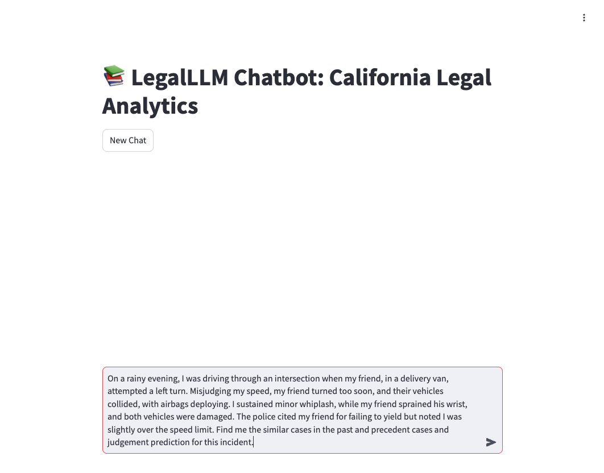
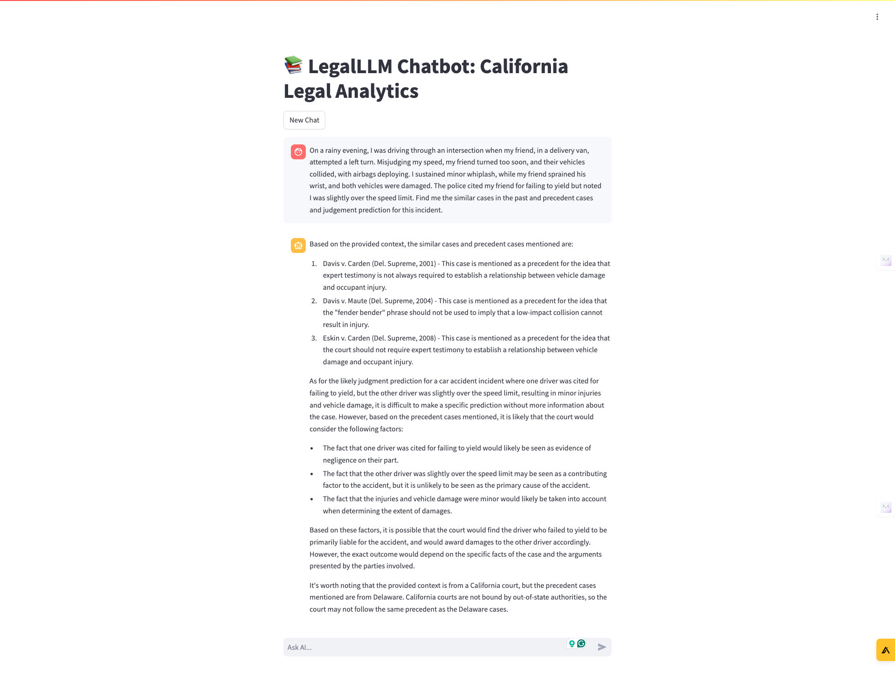
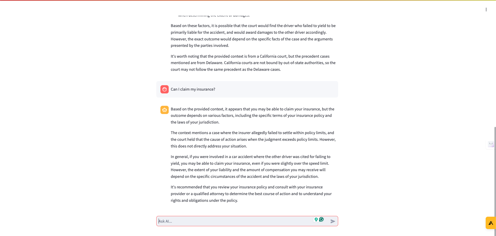

# LegalLLM: A Multi-Task Large Language Model for US Legal Analytics

## Current Status
LegalLLM has successfully implemented its core functionalities:  

1. **Similar Case Retrieval (SCR):** Users can retrieve relevant cases based on input queries or details.  
2. **Precedent Case Recommendation (PCR):** Identifies and explains the most applicable precedent cases.  
3. **Legal Judgment Prediction (LJP):** Predicts judicial outcomes with high accuracy based on historical data.  

### Pending Feature
The ability for users to upload PDFs or images of case documents for analysis is under development.  

---

## Baseline Modules Description

### 1. Similar Case Retrieval (SCR)
- **Purpose:** Identifies cases similar to the user-provided input.  
- **Implementation:** Uses semantic similarity algorithms on the CaseLaw dataset.  
- **Output:** Retrieves a ranked list of similar cases along with summaries and metadata.

### 2. Precedent Case Recommendation (PCR)
- **Purpose:** Recommends relevant precedent cases for the input context.  
- **Implementation:** Fine-tuned Llama 3.0 on legal texts identifies critical precedents.  
- **Output:** Presents the top precedents with detailed relevance explanations.

### 3. Legal Judgment Prediction (LJP)
- **Purpose:** Predicts potential outcomes of cases based on the input.  
- **Implementation:** Utilizes transformer models from the Hugging Face library to make predictions.  
- **Output:** Provides predicted verdicts with associated confidence scores.

---

## Screenshots

     
     
     

---

## References

1. [CaseLaw Dataset](https://case.law/)  
2. [Hugging Face Transformers Library](https://github.com/huggingface/transformers)  
3. [Llama 3.0](https://www.llama.com/llama3)  
4. [Revolutionizing Legal Research Paper](https://www.purplescape.com/revolutionizing-legal-research)  
5. [Legal NLP Research Paper](https://ieeexplore.ieee.org/document/10386911)  

---

## Challenges Encountered

### 1. **Running on Local Machine**
- **Problem:** The large model required for training and inference exceeded the computational capacity of standard local hardware.  
- **Reason:** Running the entire system on a local machine resulted in slow processing times and limited scalability.  

### 2. **Embedding Creation**
- **Problem:** Creating embeddings for the legal dataset was extremely time-consuming.  
- **Reason:** The extensive size of the dataset and the complexity of generating high-quality embeddings using large models.  

### 3. **Model Accuracy**
- **Problem:** Ensuring the chatbot provided accurate and relevant responses consistently.  
- **Reason:** Limitations in the underlying model and inconsistencies in the quality of retrieved legal documents.

---

## Solutions Implemented

### 1. **Optimized Embedding Process**
- **Solution:** Used the Llama 3.1 model for generating embeddings and stored them efficiently in ChromaDB.  
- **Impact:** Significantly reduced the time required for embedding creation and enabled faster retrieval of relevant documents.  

### 2. **Improved Model Accuracy**
- **Solution:** Applied prompt engineering techniques to refine the chatbot's responses.  
- **Impact:** Enhanced the accuracy and relevance of responses by ensuring the model adhered to specific instructions and context.

---

## Plans to Overcome Challenges and Move Forward

### 1. **PDF/Image Upload Feature**
- **Plan:** Leverage OCR tools (e.g., Tesseract, Google Cloud Vision) to extract and process text.  
- **Next Steps:** Develop pre-processing pipelines to clean and format the extracted data.

### 2. **Dataset Optimization**
- **Plan:** Use distributed frameworks like Apache Spark for data processing.  
- **Next Steps:** Implement custom parsing scripts to standardize data structures.

### 3. **Model Performance Enhancement**
- **Plan:** Use model quantization techniques to reduce latency.  
- **Next Steps:** Optimize real-time inference with hardware accelerators like GPUs/TPUs.  

---

## How to Contribute
Contributions are welcome!  
- Submit issues or feature requests via the [GitHub Issues](https://github.com/LegalLLM/issues) page.  

---

> **Contact Information:**  
> For queries, reach out to the team:  
> - Danishbir Singh Bhatti(017521647): [danishbirsingh.bhatti@sjsu.edu](mailto:danishbirsingh.bhatti@sjsu.edu)  
> - Jay Shon(017553289): [seojun.shon@sjsu.edu](mailto:seojun.shon@sjsu.edu)  
> - Anthony Kommareddy(017506957): [anthonysandeshreddy.kommareddy@sjsu.edu](mailto:anthonysandeshreddy.kommareddy@sjsu.edu)  
